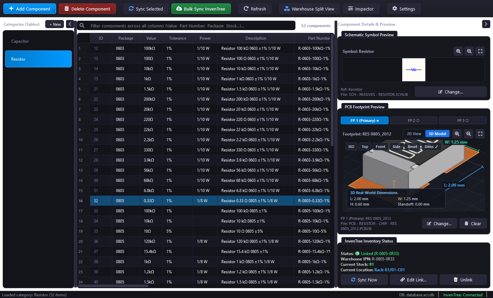
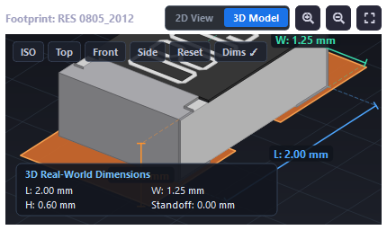
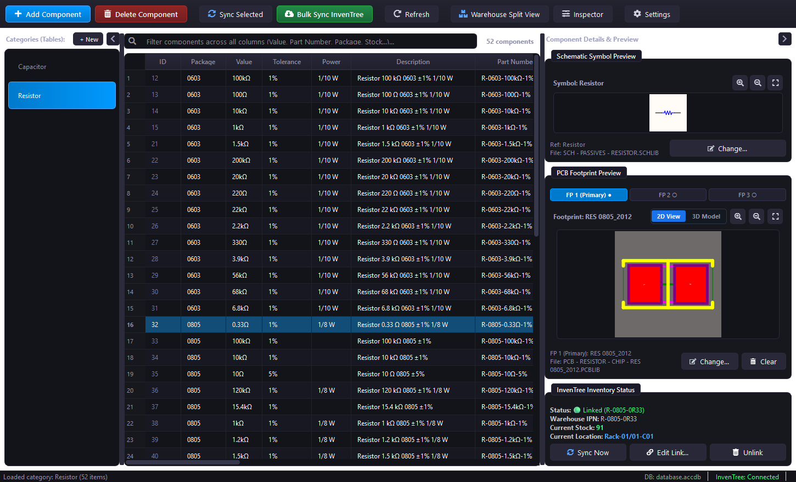
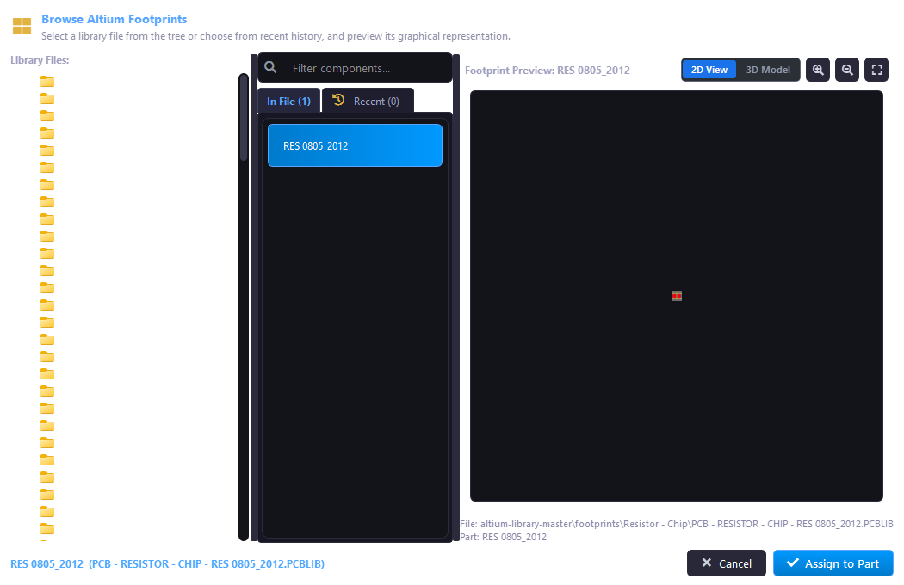

# Altium DbLib Manager

[](https://www.python.org/downloads/)
[](https://wiki.qt.io/Qt_for_Python)
[-red.svg)](https://www.microsoft.com/download/details.aspx?id=54920)
[](LICENSE)

A modern, high-performance desktop management application for **Altium Designer Database Libraries (`.DbLib`)**. Built with **Python** and **PySide6 (Qt6)**, it bridges your Microsoft Access component database (`.accdb`), your Altium schematic symbols (`.SchLib`) and footprints (`.PcbLib`), and **InvenTree** stock / inventory systems into a unified, interactive workspace.

<p align="center">
  
</p>

<p align="center">
  <em>Interactive 3D PCB footprint inspection with real-world dimensions HUD, schematic symbol preview, and live InvenTree inventory synchronization.</em>
</p>

---

## Table of Contents

- [Overview](#overview)
- [Key Features](#key-features)
- [System Architecture](#system-architecture)
- [Prerequisites](#prerequisites)
- [Installation](#installation)
- [Quick Start & Execution](#quick-start--execution)
- [Altium Component Library Setup (Celestial Library)](#altium-component-library-setup-celestial-library)
- [InvenTree Integration](#inventree-integration)
- [Project Structure](#project-structure)
- [Usage Guide](#usage-guide)
  - [1. Connecting the Database & Altium Libraries](#1-connecting-the-database--altium-libraries)
  - [2. Component Table & Category Management](#2-component-table--category-management)
  - [3. Interactive Symbol & Footprint Linking](#3-interactive-symbol--footprint-linking)
  - [4. Stock & Location Sync with InvenTree](#4-stock--location-sync-with-inventree)
- [Screenshots & Visuals](#screenshots--visuals)
- [Building Standalone Windows Executable](#building-standalone-windows-executable)
- [Contributing](#contributing)
- [License](#license)

---

## Overview

Altium Designer's Database Library architecture (`.DbLib`) allows hardware engineers to maintain single source of truth component parameters in an external relational database. However, editing Access tables directly in Microsoft Access lacks electrical engineering intelligence, footprint previews, stock synchronization, and symbol inspection.

**Altium DbLib Manager** solves this problem by offering:
- Fast spreadsheet-style editing tailored for electronics (supporting engineering unit parsing like `10k`, `100nF`, `0805`).
- Native SVG rendering of Altium Schematic Symbols (`.SchLib`).
- Interactive 2D/3D pad and outline inspection for Altium Footprints (`.PcbLib`).
- Bidirectional or real-time sync with [InvenTree](https://inventree.org/) ERP/inventory management.
- Dynamic table creation, column manipulation, and automatic synchronization with Altium `.DbLib` definition files.

---

## Key Features

- **Component Database Management**:
  - Full CRUD operations on Microsoft Access (`.accdb` / `.mdb`) tables.
  - Category / table creation, renaming, and schema editing directly within the UI.
  - Automatic synchronization of registered tables and parameter field mappings in `library.DbLib`.
  - Engineering unit parser and validator (supporting SI metric prefixes, tolerances, voltages, and powers).

- **Schematic & Footprint Visualizer**:
  - Integrated schematic symbol visualizer powered by `olefile` and `svgwrite` for ultra-sharp SVG rendering.
  - Footprint 2D/3D viewer rendering SMD/THT pads, silkscreen markings, courtyard outlines, and package geometries.
  - Dedicated Library Browser to inspect and link models directly from library directories.
  - Model preview caching for instant loading of previously inspected components.

- **InvenTree Inventory Synchronization**:
  - Real-time querying of stock counts, warehouse locations, and part descriptions via InvenTree REST API.
  - Automatic match by IPN (Internal Part Number) or manufacturer part number.
  - Batch update capabilities with intelligent unit formatting (e.g. `2.5m`, `100 pcs`).

- **User Interface & Ergonomics**:
  - Polished modern dark and light themes.
  - Global mouse wheel filters preventing accidental value changes on dropdowns and spinboxes.
  - Fast search, filtering, and sorting across extensive component databases.

---

## System Architecture

```text
+-------------------------------------------------------------------------+
|                         Altium DbLib Manager UI                         |
|                 (PySide6 / Qt6 Modern Desktop Interface)               |
+-------------------+--------------------+--------------------------------+
                    |                    |
         +----------v---------+ +--------v---------+
         | Access DB Manager  | |  Altium Engine   |
         | (pyodbc / pywin32) | | (olefile/svgwrite|
         +----------+---------+ +--------+---------+
                    |                    |
+-------------------v---+        +-------v--------------------------------+
|  Microsoft Access     |        | Altium Component Libraries             |
|  Database (.accdb)    <--------+ Symbols (.SchLib) & Footprints(.PcbLib)|
+-----------------------+        +----------------------------------------+
           ^
           | (Stock & Location Sync)
+----------v------------+
|  InvenTree Server     |
|  (REST API Client)    |
+-----------------------+
```

---

## Prerequisites

1. **Operating System**:
   - Windows 10 or Windows 11 (64-bit recommended).
2. **Python**:
   - Python **3.10** or newer.
3. **Microsoft Access Database Engine / ODBC Driver**:
   - Required for connecting to `.accdb` files.
   - If Microsoft Office / Access is not installed, install the free [Microsoft Access Database Engine 2016 Redistributable (x64)](https://www.microsoft.com/download/details.aspx?id=54920).
   - *Note: Ensure your Python architecture (32-bit or 64-bit) matches your installed Access ODBC driver.*
4. **Altium Designer** (Optional, for applying the `.DbLib` in PCB design projects).

---

## Installation

1. **Clone the repository**:
   ```bash
   git clone https://github.com/YOUR_USERNAME/Altium_library.git
   cd Altium_library
   ```

2. **Create and activate a virtual environment** (recommended):
   ```bash
   python -m venv .venv
   .venv\Scripts\activate
   ```

3. **Install dependencies**:
   ```bash
   pip install --upgrade pip
   pip install -r requirements.txt
   ```

---

## Quick Start & Execution

### Running via Python
```bash
python run_app.py
```

### Running via Batch Launcher
Simply double-click:
```text
start_app.bat
```

---

## Altium Component Library Setup (Celestial Library)

This project is configured out-of-the-box to work seamlessly with the open-source [Celestial Altium Library](https://github.com/issus/altium-library).

Due to the large size of the upstream library (~2.5 GB containing thousands of 3D STEP models, PCB footprints, and schematic symbols), it is excluded from this Git repository to maintain a fast, lightweight clone.

### Recommended Setup Steps:

1. **Clone or download Celestial Library**:
   ```bash
   git clone https://github.com/issus/altium-library.git altium-library-master
   ```
   *Alternatively, place it in any directory of your choice on your system.*

2. **Configure Library Paths**:
   - Launch **Altium DbLib Manager**.
   - Navigate to **Settings** (Gear icon in toolbar).
   - In the **Library Paths** section:
     - Set **Symbols Directory** to `altium-library-master\symbols`
     - Set **Footprints Directory** to `altium-library-master\footprints`
   - Click **Save**.

3. **Lightweight Usage (Optional)**:
   - If you only need schematic symbols and 2D/3D footprint outlines without heavy 3D STEP models, you can delete or exclude the `STEP/` folder in your downloaded copy to save ~1.7 GB of disk space.

---

## InvenTree Integration

To link your database components with live stock and warehouse locations in **InvenTree**:

1. Open **Settings > InvenTree Settings**.
2. Specify your InvenTree connection parameters:
   - **Server URL**: `http://localhost:8000` (or your InvenTree host)
   - **Username** & **Password** or **API Token**
3. Select your desired synchronization field mappings:
   - `total_in_stock` -> `Stock`
   - `location_name` -> `Location`
   - `description` -> `Description`
   - `IPN` -> `Manufacturer Part Number` / `IPN`
4. Use the **InvenTree Sync** button in the main window toolbar to perform single or batch stock synchronization.

---

## Project Structure

```text
Altium_library/
├── app/
│   ├── __init__.py
│   ├── config.py                 # Core paths, field maps, and configuration manager
│   ├── logger.py                 # Application logging setup
│   ├── altium/
│   │   ├── parser.py             # Binary parser for .SchLib and .PcbLib records
│   │   ├── footprint_3d.py       # Footprint 3D geometry & pad extractor
│   │   ├── preview_cache.py      # Cache engine for generated vector SVGs
│   │   ├── unit_engine.py        # Electronics units & tolerance computation
│   │   └── library_history.py    # Recents and favorites manager
│   ├── db/
│   │   ├── access_manager.py     # Microsoft Access (ODBC / DAO) CRUD engine
│   │   └── dblib_sync.py         # Altium .DbLib sync and table mapping
│   ├── inventree/
│   │   ├── client.py             # InvenTree API communication client
│   │   └── link_manager.py       # Local IPN / Part matching and links
│   └── ui/
│       ├── main_window.py        # Central dashboard & table management window
│       ├── table_view.py         # Spreadsheet component table with sorting/filtering
│       ├── svg_viewer.py         # Interactive QtSvg viewer with zoom & pan
│       ├── footprint_3d_viewer.py# Interactive 2D/3D footprint preview widget
│       ├── library_browser.py    # Symbol and footprint selector dialog
│       ├── settings_dialog.py    # Comprehensive paths and preferences dialog
│       ├── styles.py             # UI themes (modern dark / light styles)
│       └── icons.py              # QtAwesome vector icon helpers
├── tests/                        # Automated unit and integration test suite
├── database.accdb                # Template / default Microsoft Access database
├── library.DbLib                 # Altium Designer database library configuration
├── inventree_client.py           # InvenTree API helper module
├── run_app.py                    # Python entrypoint
├── start_app.bat                 # Convenient Windows batch launcher
├── build_exe.bat                 # Automated PyInstaller executable builder
├── build_exe.spec                # PyInstaller build specification
├── requirements.txt              # Production dependencies
├── .gitignore                    # Git ignore configuration
├── LICENSE                       # MIT License
└── README.md                     # Documentation
```

---

## Usage Guide

### 1. Connecting the Database & Altium Libraries
When first launched, the app automatically initializes `database.accdb` and checks for `library.DbLib`. You can verify your connection in **Settings**:
- Test Access ODBC connection with a single click.
- Browse and select your `.accdb` file.

### 2. Component Table & Category Management
- Select categories (e.g. `Capacitor`, `Resistor`, `Inductor`) from the left sidebar.
- Add rows, inline-edit values, or adjust electrical ratings.
- Create new categories via **New Table**; the manager will automatically create the table in Microsoft Access and register the category in `library.DbLib`.

### 3. Interactive Symbol & Footprint Linking
- Double-click any component row to view its schematic symbol and footprint.
- Click **Browse Model** to open the **Library Browser**.
- Filter through available `.SchLib` and `.PcbLib` files in your library directory.
- Select a symbol/footprint to instantly link it to the selected component.

### 4. Stock & Location Sync with InvenTree
- Click **Sync InvenTree**.
- The system matches each row's IPN with InvenTree inventory items.
- Real-time stock counts and storage rack locations are written directly into your database.

---

## Screenshots & Visuals

| Interactive 3D Footprint CAD Viewport | Real-Time 3D Dimensions & HUD Card |
|:---:|:---:|
|  |  |

| Category Table & 2D Vector Previews | Altium Library Browser & Model Selector |
|:---:|:---:|
|  |  |

---

## Building Standalone Windows Executable

To bundle the application into a standalone Windows `.exe` without requiring Python on the target computer:

```bash
# Run the automated build script:
build_exe.bat
```

The script will:
1. Verify PyInstaller installation.
2. Clean previous build caches.
3. Bundle all Qt6 libraries, ODBC connectors, and dependencies into `dist\AltiumDbLibManager.exe`.
4. Copy `database.accdb` and `library.DbLib` into the portable output directory.

---

## Contributing

Contributions, bug reports, and feature requests are welcome!
1. Fork the repository.
2. Create your feature branch (`git checkout -b feature/AmazingFeature`).
3. Commit your changes (`git commit -m "Add some AmazingFeature"`).
4. Run the test suite (`python -m unittest discover tests`).
5. Push to the branch (`git push origin feature/AmazingFeature`).
6. Open a Pull Request.

---

## License

This project is licensed under the **MIT License** - see the [LICENSE](LICENSE) file for details.
